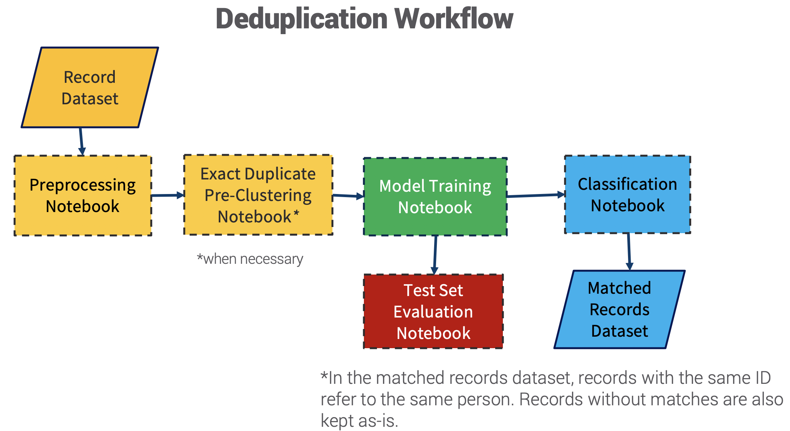
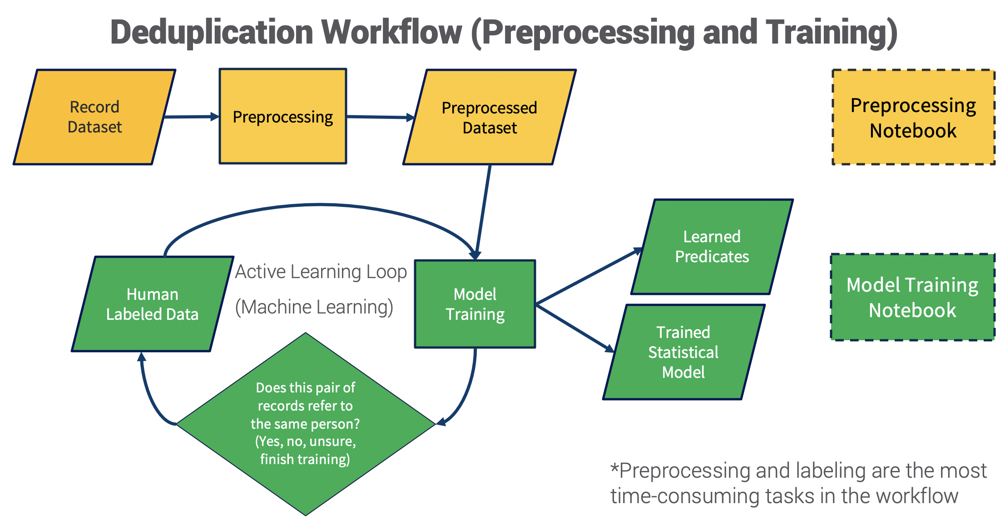
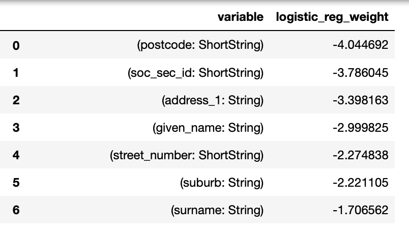
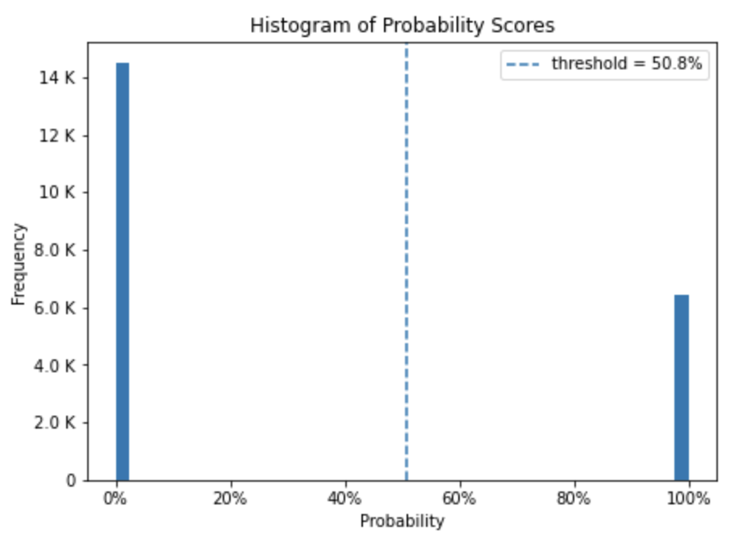

# data-matching-workflow
Make it easier to match records with high accuracy. :tada: This is a template workflow for deduplication and record linkage that uses the [dedupe library](https://github.com/dedupeio/dedupe). It uses [active learning](https://en.wikipedia.org/wiki/Active_learning_(machine_learning)) to train models for matching records.

Try it out on Binder! 

## How this can be useful? :thinking:
Many organizations rely on having an accurate database of records, such as customer records. However, a common issue is that multiple records may actually refer to the same entity, or the same person. In banking for example, a person may sign up for a deposit account, and then sign up for a credit card. However, the bank may not know that the two accounts refer to the same person. Data matching techniques aim to solve that problem. 

*Duplication (simple) example with 4 identifier fields: mispelling in Last Name :scream:*
| Data Source     | First Name | Last Name | Birthday  | Postcode |
|:------------:|:----------:|:---------:|:---------:|:--------:|
| Deposits     | Michael    | Fernandez | 29-Sep-83 | 1512     |
| Credit Cards | Michael    | Fernandes | 29-Sep-83 | 1522     |

## Workflow Overview  
This workflow can be split into 4 main tasks. Under the `notebooks` folder, there are 4 subfolders corresponding to each task. Each subfolder contains a set of notebooks for the subtasks. Here's an overview of the main tasks, and their respective subtasks:
- **Preprocessing** (`preprocess`) 
A comprehensive template for data cleaning before the matching proper. Must be used before deduplication and/or record linkage.
  1. *Main Preprocessing* 
  2. *Exact Duplicate Handling (optional)*
       - Use this only if there is rampant exact matches in all fields in your dataset.
- **Deduplication** (`dedup`) Used for identifying duplicates within a set of records.
  1. *Model Training*
      - Train the model using active learning. After training, model will be able to distinguish if two records refer to the same entity/person or not. 
      - Outputs of this subtask are: labeled training data, [blocking predicates](http://www.cs.utexas.edu/~ml/papers/blocking-icdm-06.pdf), and Logistic Regression model weights.
  2. *Classification* 
      - Use the model to classify matches for the rest of the dataset.
      - Check the blocking predicates and model weights to interpret the model.
      - Inspect diagnostic measures and plots to check for matching quality.
  3. *Test Set Evaluation*
      - Split the labeled training data into a training and test set.
      - Re-train the model and evaluate on the test set to have a out-of-sample diagnostic measures.
      - Diagnostic measures here complement the diagnostic measures in *Classification*. 

- **Record Linkage** (`rl`) Used for identifying matches between two sets of records. Each set of records must not have duplicates to begin with.
  - These notebooks are similar to those under Deduplication.
  1. *Model Training*
  2. *Classification*
  3. *Test Set Evaluation*
- **Fusion** (`fusion`) Used as a final step after performing record linkage on multiple pairs of records. Creates a unique identifier across all sets of records.

*Flowchart for Deduplication*

*Flowchart for preprocessing and training (under Deduplication)*

## Example Use Cases
How you would use the workflow depends on the kind of record datasets you have. The steps may vary and here are some examples:
- There is 1 set of records with duplicates.
  1. Preprocess
  2. Perform deduplication
- There are 2 sets of records, A and B. There aren't duplicates within each set, but there are duplicates across sets.
  1. Preprocess each of A and B
  2. Perform recordlinkage for A and B
- There are 3 sets of records: A, B, and C. There are be duplicates within each set, and there are duplicates across sets. 
  1. Preprocess each of A, B and C. 
  2. Perform duplication for A, B, and C. 
  3. Perform record linkage for 3 pairs: (A,B), (B,C), and (C,A). 
  4. Perform fusion on the 3 linked pairs. 

## Advantages of Active Learning in Data Matching

Active learning has several advantages over other methods that rely on pre-determined rules (e.g. exact duplicate only, vanilla [edit distance](https://en.wikipedia.org/wiki/Edit_distance) approach).
1.	Adaptability
    -	Can adjust if a record has some missing (e.g. NULL) fields.
    -	Can quantify and assign relative importance of different fields 
        -	For example, birth date and social security number are typically more distinguishing fields than country of birth.
        -	Methods that treat all fields equally will tend to misidentify family members as the same person.

    - *Example of Model Weights*. More negative features are more "important" when comparing two records.

      
    
2.	Diagnostics capability
    -	Ground truth is collected during the active learning process. This allows us to compute measures of matching quality. Traditional methods don’t have a way of assessing matching quality.

    - *Pair match score histogram example*. Scores of record pairs, with higher scores mean more likely match. Below shows a very confident model with mostly 0 or 100% scores.

      
    
    - *Test Set [Confusion Matrix](https://en.wikipedia.org/wiki/Confusion_matrix) example*. Among the 26 record pairs in the test set, 92.3% were classified correctly.
  
  |                         |Match Pairs (Actual)|Nonmatch Pairs (Actual)|
  |:-----------------------:|:------------------:|:---------------------:|
  |Match Pairs (Predicted)   |  13               |   0                   |
  |Nonmatch Pairs (Predicted)|   2               |   11                  |

## Sample Datasets
Sample datasets were used from the [recordlinkage library](https://github.com/J535D165/recordlinkage) to demostrate workflow examples. For deduplication, the `febrl3` dataset was used. For record linkage, the `febrl4` dataset was used (and split into two sets: `febrl4a` and `febrl4b`).

These datasets are available under the `saved_files` folder:
  - `saved_files/febrl3`
  - `saved_files/febrl4a`
  - `saved_files/febrl4b`

## How to Set Up for Your Own Datasets :wrench:
Refer to `set-up-own-dataset-instructions.md`

## Python Dependencies
Refer to `environment.yml`

## Credits
[Learnable Similarity Functions and their Application to Record Linkage and Clustering](http://www.cs.utexas.edu/~ml/papers/marlin-dissertation-06.pdf)
